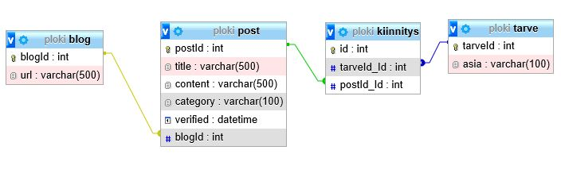
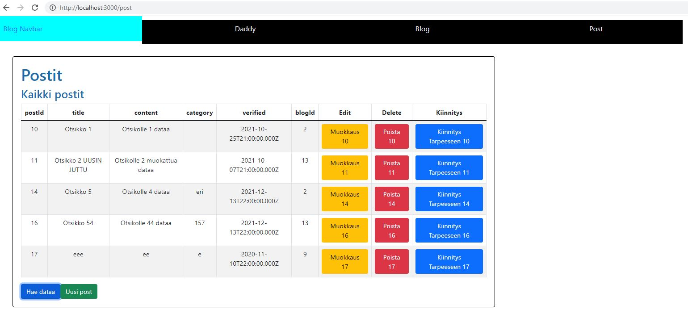

# blogReactNodejsApp

## 1. Yleistä

### 1.1 Näkymä Pääkansiorakenteesta

Koko sovellus on ReactNodejs-kansiossa.
Kuvat on reactcodes-kansion image-kansiossa. 
Backend-koodi on nodejs-express-sequelize-mysql-kansiossa.
Frontend-koodi on reactcodes-kansiossa.

## 2. SQL

Tietokanta on luotu oppilas-tietokanta phpMyAdmin-ohjelmalla.



## 3. Backend

Backend-koodi om luotu Nodejs:llä. 

Backend-serveri laitetaan päälle seuraavasti...
Mene nodejs-express-sequelize-mysql-kansion juureen (pääkansio) ja avaa node server komennolla `nodemon ./node/index.js` 
Avautuu localhost-porttiin 3002.
Kun serveri käynnistyy komentokehotteessa näkyy seuraavaa...

```
[nodemon] 2.0.7
[nodemon] to restart at any time, enter `rs`
[nodemon] watching path(s): *.*
[nodemon] watching extensions: js,mjs,json
[nodemon] starting `node ./node/index.js`
Server running at http://127.0.0.1:3002/
```

## 4. Frontend

Frontend-koodi om luotu React:lla. 

Frontend-serveri laitetaan päälle seuraavasti...
Mene reactcodes-kansion juureen (pääkansio) ja avaa node server komennolla `npm start` 
Avautuu selaimeen localhost-porttiin 3000.

Näkymä Post-linkistä:


## 5. Tarpeen kiinnitys Postiin

Postiin voidaan kiinnittää tarve. Tarve voidaan kiinnittää vain yhteen postiin. 
Kun se kiinnitetty johonkin postiin, sitä ei enää näy Tarve-alasvetovalikkossa.
backend-koodin tarveController.js:ssä haetaan Tarve-alasvetovalikkoon vain 
vapaat tarpeet.

Näkymä Post-linkistä:


